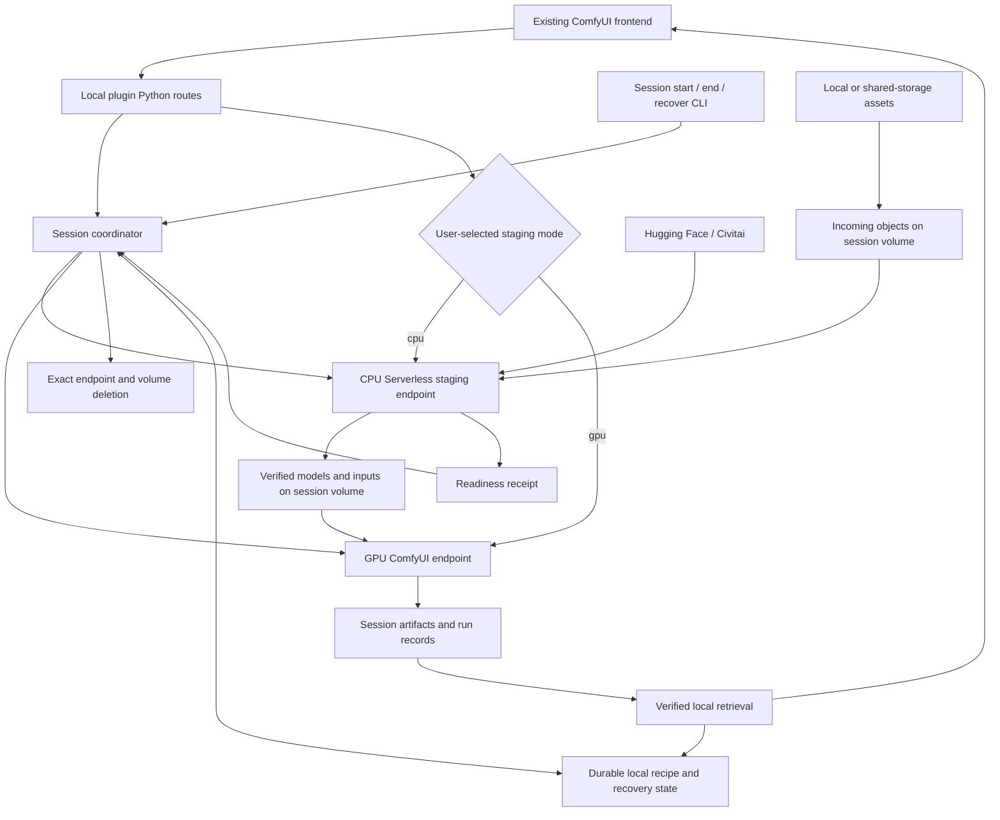
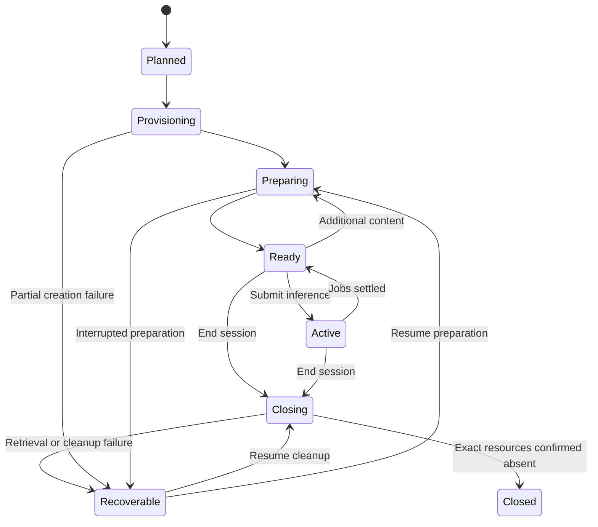

# Selectable CPU staging and disposable creative sessions

Status: proposed architecture with initial local safeguards implemented. CPU
staging is an opt-in mode; GPU-only staging remains a supported compatibility
mode and no CPU staging deployment is implied by this document.

Prepared: 2026-09-10.

Source baseline: ComfyUI-RunOnRunpod commit `d5b504d` and the separately
maintained `runpod-comfy` project at commit `929ab8f`. Source references describe
those revisions. Reconcile intervening changes before implementation.

Implemented foundation on this branch: output downloads use unique local partial
files, validate the S3 byte count, and publish atomically. Incomplete retrieval
keeps the entire remote output set and is reported as a failure rather than an
empty success. Worker output paths are confined to the local output root. This
provides the cleanup barrier needed by later disposable-session work; artifact
checksums and durable retrieval ledgers remain planned.

Also implemented: a versioned, pure model resource-plan compiler records each
supported workflow model target and its node/input bindings. The submit path
uses that plan to reject unsafe, ambiguous, or unresolved missing requirements
before any GPU version or node-capability action. It retains the legacy source
fetch/upload executor after a plan is complete; replacement with CPU Serverless
staging remains planned.

Implemented next: local files are materialized as SHA-256 plus byte size, and
remote workflow metadata must provide the same immutable identity. A model is
ready only when its volume object has a matching versioned readiness receipt;
the receipt is cleared before replacement and published only after size
verification. Legacy source lookups without exact identities safely fall back
to a local upload or are rejected. The legacy GPU fetch action now validates
both expected hash and size and emits the receipt only after completion. This
is a transitional executor, not the future CPU Serverless stager; its protocol
is version 2 and requires rebuilding the worker image.

Implemented next: `cpu_staging_contract.py` defines CPU staging protocol v1,
strict request/result validation, target confinement, exact identities, volume
binding, and HMAC-signed coordinator envelopes. `worker-cpu/` is a thin
CPU-only Serverless image that validates this envelope before downloading or
writing. `cpu_stager_client.py` is wired as an opt-in replacement for the
legacy GPU fetch action only when a matching coordinator-signed request is
present. No CPU endpoint is deployed or enabled by browser settings, and no
live RunPod operation has been performed.

Implemented next: `coordinator/` persists atomically versioned recipes,
session bindings, authorization intent, and validated CPU completion records.
It generates HMAC envelopes from the server-side signing key only after saving
the exact request. With `managedSessionId`, the route obtains the CPU endpoint
and signed request from this local state instead of browser settings. Lifecycle
adapter calls that create, attach, or delete RunPod resources remain unimplemented.

Implemented next: the coordinator has a versioned managed-profile schema and
a provider-neutral lifecycle service. It journals create/delete intent before
every provider operation, records exact returned bindings, uses recovery hooks,
and closes CPU endpoints before volumes. Its fake-provider tests cover partial
provisioning and resumable closure.

Implemented next: `coordinator/runpod_adapter.py` is a guarded RunPod REST
implementation. It creates a per-session volume, then a CPU endpoint attached
to that exact volume, using a server-owned template ID and min/max workers of
zero/one. It verifies the provider responses, records a resource ID plus
ownership name, re-observes that evidence on recovery, and refuses deletion if
the evidence no longer matches. Name-only reuse after an uncertain create is
deliberately rejected for manual reconciliation. Mutations default to disabled,
the adapter is not yet constructed by routes or browser settings, and its tests
use a fake HTTP transport only; no live RunPod operation is enabled by this
increment.

Implemented next: `python -m coordinator.managed_sessions` is an
operator-only CLI for `start`, `status`, `recover`, and `end`. Mutating commands
require all of `RUNONRUNPOD_MANAGED_LIFECYCLE=enabled`,
`RUNONRUNPOD_COORDINATOR_ROOT`, `RUNONRUNPOD_MANAGED_PROFILE_PATH`, and a
server-side `RUNPOD_API_KEY`; the state root must already exist and the profile supplies the trusted CPU template ID
and cannot be supplied by browser settings. `end` requires an explicit
`--outputs-retrieved` acknowledgement until durable output retrieval records
can enforce that condition automatically. The CLI is not registered as a
ComfyUI request route.

Implemented next: the existing plugin settings now expose `Model staging mode`.
The default `gpu` value keeps the main-branch-compatible GPU fetch path even if
stale CPU fields are present. Selecting `cpu` requires a matching signed CPU
staging request and fails closed rather than falling back to GPU downloads.
Hermetic tests cover both executor choices and invalid mode rejection.

Implemented next: `integration/runpod_cpu_stager_smoke.py` is an explicitly
opt-in live harness (`--live`) for the CPU path. It uses the coordinator,
lifecycle adapter, secret-reference endpoint environment mapping, signed request,
CPU client, and cleanup flow to create one temporary volume/CPU endpoint, stage
one pinned download, and delete the exact recorded resources. `--pause-after-create`
allows RunPod-console inspection before staging and cleanup. It is never run by
ordinary test discovery and has not been run against a live account here.

## 1. Objective and scope

Preserve ComfyUI-RunOnRunpod's frontend and creative workflow while moving
model downloads, integrity checks, and storage preparation to an optional
queue-based CPU Serverless endpoint. The user selects either CPU-managed
staging or compatible GPU-only staging for each creative session. In CPU mode,
GPU workers receive inference work only after required content is available on
the session's network volume. In GPU-only mode, the same GPU endpoint stages
then runs ComfyUI, closely preserving the main-branch workflow.

Use one disposable network volume per creative session. Reuse its verified
content across multiple jobs, including periods when both endpoints scale to
zero. At the user's request, retrieve retained outputs and delete the session
resources, including the volume. A locally retained recipe reconstructs the
working set on a fresh volume for a subsequent session.

Requirements:

- Preserve the sidebar, Run action, model progress, job history, cancellation,
  settings, output previews, and existing file-cleanup actions.
- Make the staging mode visible and explicit: `cpu` or `gpu`.
- Never use the GPU endpoint to download source assets in CPU-managed mode.
- Before CPU-managed staging is declared complete, make its end-to-end session
  path S3-free: input transfer, local-model installation fallback, readiness
  evidence, output retrieval, and cleanup must not require a RunPod S3-enabled
  data center, bucket, access key, secret key, or S3-compatible API. A generic
  authenticated HTTPS artifact-transfer boundary is acceptable; moving the
  dependency to an external S3-compatible service is not sufficient.
- Preserve the GPU-only download/stage/infer sequence when `gpu` is selected;
  require only narrowly scoped safety and protocol consistency changes.
- This S3-removal requirement applies only to CPU-managed staging. GPU-only
  staging retains its existing RunPod-S3 transport and compatibility behavior.
- In CPU mode, do not submit GPU liveness or capability jobs while preparing
  content; preserve GPU-only ordering for compatibility.
- Block inference until every required asset has a matching verified receipt.
- Preserve exact workflow filenames and node/input bindings.
- Restore a working set without rediscovering sources, manually creating
  resources, or repeatedly entering resource IDs.
- Never delete the only retained copy of requested outputs during cleanup.
- Persist recovery information independently of the disposable volume.
- Every HTTP request to a RunPod-operated API must explicitly set a project
  User-Agent header; client-library default User-Agent values are prohibited.
- RunPod REST API v1 is deprecated. Do not use it in new code.

Non-goals for the initial implementation:

- Replacing the frontend with n8n or a new application.
- A persistent user-facing model catalog or permanent paid cloud model cache.
- Inferring dependencies from arbitrary filename-like custom-node inputs.
- Installing executable custom-node code through content staging requests.
- Multi-region replication, shared multi-user staging, or distributed download
  scheduling.
- Eliminating GPU image startup, storage-to-memory model reads, or GPU model
  loading. Those remain part of inference startup.

## 2. Current behavior and integration points

| Current integration point | Observed behavior | Required change |
| --- | --- | --- |
| `routes.py::_do_submit` | Calls GPU `version` and `node_list` before input/model preparation. | Move these after verified staging; later support image-bound capability metadata for early checks. |
| `routes.py::_prepare_models` | Scans references, checks S3 existence, resolves sources, invokes GPU fetches, then uploads local files. | Build an exact resource plan; choose CPU staging or the compatible GPU executor according to the user-selected mode; enforce identities in either mode. |
| `routes.py::_identify_missing_models` | An existing object key counts as available. | Compare expected identity against a verified receipt in either staging mode. |
| `routes.py::_run_worker_fetches` | Sends `fetch_models` and provider tokens to the GPU endpoint. | Retain GPU fetching only in `gpu` mode, but read provider tokens from worker environment variables rather than job payloads. CPU mode uses the separate CPU client. |
| `routes.py::_resolve_model_sources` | An unresolved asset can fail to enter either the fetch or upload queue without stopping submission. | Return explicit unresolved entries and block GPU work. |
| `model_lookup.py` | Useful discovery chain; some results are filename matches, mutable URLs, or lack hashes. | Retain discovery and add exact-source materialization before signing. |
| `worker/model_fetcher.py` | Downloads on GPU, publishes before optional checksum verification, and lacks shared target locks. | CPU mode uses the donor CPU staging core; GPU mode retains this worker with targeted identity, receipt, and credential-delivery fixes. |
| `worker/start.sh` | Links models only if the volume directory already exists; supports startup-time custom-node installation. | Validate mounts and establish paths before ComfyUI starts; bake executable dependencies into images. |
| `worker/handler.py::save_outputs` | Copies into `outputs/<timestamp>_<job-id>/`, flattening basenames. | Publish collision-safe per-run artifacts and immutable run records. |
| `routes.py::_download_and_cleanup` | Deletes all listed remote outputs even if local downloads failed. | Delete only verified retrieved outputs and retain recovery state. |
| `routes.py::_poll_and_finish` | Provider `COMPLETED` is not comprehensively separated from application success and retrieval success. | Validate each stage separately. |
| `routes.py::clean_storage` | Deletes files under selected prefixes, including models for `all`. | Preserve semantics, coordinate active operations, and invalidate affected inventory. |
| `web/js/extension.js` | Existing events support preparation progress; settings assume concrete resource IDs. | Preserve presentation/events; add managed-profile and resource-binding plumbing. |

The output cleanup defect must be fixed before automated volume deletion is
enabled. File deletion is distinct from deleting the allocated storage resource.

## 3. Target architecture and ownership



| Component | Owns | Must not own |
| --- | --- | --- |
| Frontend | Existing workflow submission, display, history, cancellation. | Signing keys, lifecycle state, provider download implementation. |
| Local plugin gateway | ComfyUI paths, workflow metadata, existing routes/events, local uploads/output delivery. | Independent staging or cleanup implementations. |
| Session coordinator | Profiles, recipes, source materialization, signing, resource bindings, durable jobs, RunPod lifecycle, readiness, recovery. | Browser presentation or wholesale workflow rewriting. |
| CPU worker (`cpu` mode) | Signed request validation, downloads, upload installation, hashes, locks, receipts, capacity/transfer policy. | Inference, cloud deletion, arbitrary code installation. |
| GPU worker (`cpu` mode) | Job binding checks, staged-model loading, ComfyUI execution, output publication. | Source download fallback, model replacement, model-provider credentials. |
| GPU worker (`gpu` mode) | Compatible model download/staging followed by ComfyUI execution and output publication. | Cloud deletion, arbitrary code installation. It may receive only the provider secrets configured in its endpoint environment. |
| Shared core package | Donor manifest/signing/staging/output/lifecycle logic. | ComfyUI server imports and frontend dependencies. |

Keep the coordinator on Gentoo initially, consistent with the donor's platform
boundary and POSIX lifecycle-state locking. Windows remains authoritative for
workflow authoring, exact local ComfyUI filenames, and local-file discovery.
The plugin gateway communicates with the coordinator over an authenticated,
explicitly configured private connection. Browser requests cannot choose
arbitrary coordinator URLs or independently authorize lifecycle changes.

Package the donor core as one versioned dependency, pinned to an immutable source
revision during development. Do not depend on an adjacent checkout or a
machine-specific import path. Keep one maintained downloader implementation.
Preserve attribution and establish redistribution permission/licensing before
publishing incorporated donor code.

## 4. Deployment and compute policy

Each managed session owns one network volume and local durable records. CPU
mode additionally owns one CPU staging endpoint and one GPU endpoint attached
to the same volume in one data center. GPU-only mode has one GPU endpoint that
both stages and runs ComfyUI; it follows the existing manually configured
endpoint/volume flow unless the user also selects disposable-session lifecycle
management. Create the GPU endpoint after initial CPU staging where practical.

The UI setting is a user choice, not an automatic cost heuristic:

| `stagingMode` | Resources and flow | Compatibility / policy |
| --- | --- | --- |
| `gpu` (default) | Existing GPU endpoint resolves/downloads missing models, then executes the workflow. | Preserve main-branch behavior and settings. Apply immutable identity, atomic publication, and environment-only provider credentials, but do not require a CPU endpoint or a managed session. |
| `cpu` | CPU endpoint downloads/verifies/installs required models on the session volume; GPU endpoint starts only after readiness succeeds. | Requires a compatible CPU profile, shared session volume, signed stage request, and CPU-mode receipt barrier. CPU failures never fall back silently to GPU downloading. |

| Setting | Initial policy |
| --- | --- |
| CPU compute type | Explicitly `CPU`, never a provider default. |
| CPU workers | Minimum 0, maximum 1. |
| CPU transfers | One active operation and one transfer at a time. |
| GPU workers | Minimum 0; initially maximum 1, retaining frontend multi-job queuing. |
| Idle timeout | Short, configurable, recorded in the profile; measure cold-start tradeoffs. |
| GPU source fetching | Disabled in `cpu` mode; permitted in `gpu` mode. |
| Images | Immutable digests for both worker types. |
| Data center | Explicit intersection of volume support, CPU availability, and desired GPU availability. |

A CUDA-free image does not make an endpoint a CPU endpoint. Set and verify the
provider's actual compute type. The CPU image needs no ComfyUI, CUDA, or PyTorch.

The donor lifecycle schema lacks explicit CPU flavor/vCPU selection, GPU
preferences, and endpoint execution deadlines. Add them through a versioned
specification extension and verify effective provider configuration after
creation. Validate provider-specific ranges instead of assuming the donor's
generic schema guarantees acceptance by RunPod. Mode selection is distinct from
the profile: it only selects an already validated `cpu` or `gpu` resource policy.

RunPod documents CPU endpoints, volume attachment, worker counts, and execution
deadlines in its [endpoint API](https://docs.runpod.io/api-reference/endpoints/POST/endpoints).
Its [volume documentation](https://docs.runpod.io/storage/network-volumes)
describes the `/runpod-volume` Serverless mount and shared-volume constraints.
These establish capability, not current availability in a particular account or
data center. Recheck availability before deployment.

### RunPod API request identification

This is a required integration specification for every HTTP request sent to a
RunPod-operated API: the v1/v2 control and catalog APIs, the Serverless job API,
and any RunPod S3-compatible API used by the GPU-only compatibility path. Each
request **MUST** explicitly set `User-Agent`; it must override a value supplied
by Python, an HTTP client, or an SDK by default. A default value such as
`Python-urllib/<version>` is non-compliant.

The value must identify this project, the sending component, and that
component's release version, for example
`ComfyUI-RunOnRunpod-DatacenterAvailability/0.3.1`. It must not contain an API
key, provider token, session ID, workflow content, user identity, or other
secret/personal data. Shared RunPod transport helpers should set the header at
construction; every direct request path must do the same. Tests for each
transport must assert the explicit value, including failure paths where the
request is observable. Debug output may display the User-Agent but must
continue to redact authorization and cookie values.

## 5. Credentials and secret delivery

### User credentials and their boundary

The user supplies their RunPod API key and S3 credentials through the existing
ComfyUI plugin settings. The local ComfyUI Python backend uses them only for the
user's RunPod API requests and local S3 transfers. They are not written into
recipes, profiles, session records, progress events, logs, job payloads, or
worker images. The plugin must treat values received from browser settings as
request-scoped secrets, redact them from exceptions, and discard them when the
request/background job no longer needs them.

Those S3 credentials remain part of the compatible GPU-only path. They are a
transitional CPU-mode implementation detail, not a completion requirement for
CPU-managed staging. Before CPU mode is declared complete, replace its S3
operations with a transport-neutral authenticated HTTPS artifact boundary for
inputs, local-model fallback, readiness evidence, output retrieval, and
cleanup. CPU mode must not require any S3 endpoint, bucket, or S3 credential
from the user or the selected RunPod data center. Do not change the GPU-only
mode's S3 settings, credential handling, or data path as part of that work.

Hugging Face and CivitAI credentials follow a stronger worker-delivery rule:

1. The user creates each provider credential as a RunPod stored secret in the
   RunPod administrative web UI.
2. The user maps its secret reference to `HF_TOKEN` and/or `CIVITAI_API_KEY` in
   the relevant CPU and/or GPU Serverless endpoint configuration. Only the
   endpoint selected by the mode receives the provider secret.
3. Worker code reads only those environment variables. Neither a RunPod job
   payload nor a signed staging envelope contains a provider-token value.
4. The plugin may retain/display a non-secret reference name after user consent,
   but it must never read, persist, or log the stored secret value.

The current `hfToken` and `civitaiApiKey` plugin settings are transitional.
Replace them with optional non-secret reference/status fields, and remove their
values from all `fetch_models` and CPU staging request payloads in both modes.
The plugin can report that a required secret mapping is missing, but it must not
attempt to test, retrieve, or echo the secret value.

RunPod documents Serverless runtime environment variables configured in the
console, and separately documents encrypted stored Secrets and template
references. This architecture assumes the published
`{{ RUNPOD_SECRET_<name> }}` reference behavior is consistent for Serverless
endpoint environment mappings and the RunPod API unless RunPod demonstrates
otherwise. Use the provider's secret selector/mechanism rather than copying a
token into a plain endpoint environment field. The opt-in live CPU smoke
harness tests the endpoint creation and one authenticated staging download with
user-supplied secret names.

If RunPod publishes a supported secret-management REST API for Serverless,
plugin-assisted enrollment may be added behind an explicit user action: the
user enters a provider token in the plugin, the local backend sends it directly
to that documented API over HTTPS, retains only the returned secret identifier
or reference, and immediately discards the value. This is conditional work, not
an assumed API: the currently documented REST resource list covers compute,
endpoints, volumes, templates, registry authentication, and billing, but does
not document secret CRUD. Never guess an endpoint or use an undocumented API.

The CPU-stage HMAC key is not a user provider credential. It is a deployment
authorization secret with the same value in the local coordinator's protected
configuration and the CPU endpoint's securely injected runtime environment.
It is never a ComfyUI setting, request field, recipe value, or worker result.

### Credential matrix

| Value | Obtained from | Stored / injected into | Allowed consumers |
| --- | --- | --- | --- |
| RunPod API key | User via ComfyUI plugin | Request-scoped local backend memory; no coordinator record | Local backend calling RunPod APIs, including lifecycle when user chooses it |
| S3 access key and secret | User via ComfyUI plugin | Request-scoped local backend memory | Local backend S3 uploads, downloads, and receipt operations |
| Hugging Face token | User in RunPod Secrets web UI; optional future plugin-to-documented-secret-API enrollment | RunPod secret injected as `HF_TOKEN` into selected CPU/GPU endpoint | CPU worker in `cpu` mode or GPU worker in `gpu` mode |
| CivitAI API key | User in RunPod Secrets web UI; optional future plugin-to-documented-secret-API enrollment | RunPod secret injected as `CIVITAI_API_KEY` into selected CPU/GPU endpoint | CPU worker in `cpu` mode or GPU worker in `gpu` mode |
| CPU staging HMAC key | User/operator provisions matching local and RunPod deployment secret | Protected local coordinator configuration and CPU endpoint runtime secret | Local coordinator signer and CPU worker verifier only |
| Endpoint IDs, volume IDs, secret reference names | User/profile/coordinator | Non-secret settings and durable session/profile records | Backend and UI display only; never treated as credential values |

## 6. Durable recipes, runtime records, and storage layout

### Reusable recipe

A recipe records how to reconstruct content, without credentials, temporary
download URLs, or cloud resource IDs:

- Recipe ID/revision and workflow content/hash.
- Explicit model-bearing node/input bindings.
- Exact target paths, sizes, SHA-256 hashes, and source candidates.
- Provider repository/object/version identity and remote file path.
- Relative references to retained local/private assets.
- Immutable runtime images and custom-node capability requirements.
- The selected working set, with lazy first-workflow staging as an alternative
  to restoring the whole set.
- Timestamps and source-resolution evidence.

Save recipe changes when models are added, not only at session shutdown. A recipe
is a working-set definition, not an inventory of every model the user owns.
Existing local model management remains independent.

### Mutable runtime records

Keep separate records for:

- Session ID and profile/recipe revision.
- Volume and endpoint IDs, image digests, and data center.
- Create/delete operation IDs and resource ownership evidence.
- Preparation IDs, CPU/GPU job IDs, request identities, terminal classifications.
- Readiness receipts and exact workflow/resource-plan hashes.
- Output publication and local retrieval ledgers.
- Cleanup intent, remaining resources, and recoverable failures.

Suggested application layout beneath an explicitly configured local storage root:

```text
runonrunpod/
  profiles/<profile-id>/profile.json
  recipes/<recipe-id>/recipe.json
  sessions/<session-id>/session.json
  sessions/<session-id>/jobs/<run-id>.json
  sessions/<session-id>/outputs/...
  sessions/<session-id>/retrieval/...
```

The donor lifecycle store currently uses
`.runpod-comfy/sessions/<session-id>/lifecycle/state.json`. Preserve that through
an adapter initially. The application session record references it; do not keep
two authoritative copies of resource ownership state.

Suggested volume ownership layout:

```text
models/<comfy-category>/<exact-filename>
inputs/<sha256><extension>
incoming/<upload-id>/<asset-id>
outputs/<session-id>/<run-id>/artifacts/...
.runpod-comfy/...                    # existing staging records and locks
<output-record-prefix>/...           # donor output contract, mapped explicitly
```

Implement output paths using the donor's actual record/schema rules. The tree
illustrates ownership rather than redefining that contract.

Keep one final copy of each model at its exact ComfyUI path initially. Defer a
blob/symlink cache, which complicates the donor's path and alias-locking rules.
Checksums identify content even when storage uses ordinary model paths.

Reuse matching files within a session. A different binary at the same path is a
conflict, never an automatic overwrite. Resolve it through an explicit new
binding or new session. Preserve filenames unless a requested selection requires
substitution.

Volume deletion removes the cloud cache, not the recipe or retained local
outputs. A subsequent session has a new session ID and fresh resource IDs; it
does not reopen an already-deleted lifecycle record.

Remote restoration depends on upstream availability and access. Retain local
copies of private or irreplaceable objects. A recipe/checksum cannot reconstruct
bytes that disappear upstream. Local retention does not require paid RunPod
storage between creative sessions.

## 7. Discovery and exact-source materialization

Retain `MODEL_NODE_FIELDS` as the initial explicit adapter registry. Extend it
deliberately for supported custom nodes. Preserve every node/input occurrence
even if multiple bindings use one asset. Deduplicate transfers by target path
and expected identity, never basename alone.

Separate two operations:

1. Discover candidates from workflow metadata, opt-in Manager lookup, local
   Hugging Face cache information, Civitai lookup, and local files.
2. Materialize an immutable resource plan that can be signed and verified.

Preserve existing preferences: workflow metadata remains a candidate independent
of optional third-party lookup, lookup respects the user's setting, and local
upload remains a fallback. Disabling automatic preparation permits only assets
that already satisfy readiness; it cannot bypass the readiness barrier.

Materialization rules:

- A local file supplies exact size/SHA-256. Reject source candidates resolving to
  different bytes.
- A filename match alone does not establish identity.
- Pin Hugging Face commits and retain repository-relative paths. The plugin's
  current `resolve/main` reconstruction is insufficient. The donor's
  basename-only resolver needs a pinned explicit URL or a schema/resolver
  extension for nested paths and renamed local files.
- Pin Civitai model/version/file identity and match integrity metadata. Preserve
  the authoritative `.red` or `.com` origin.
- Obtain trustworthy size/hash metadata before constructing the strict donor
  manifest. A remote-only object lacking it is unresolved in the first release.
- A future explicit CPU enrollment operation could download an unpinned object
  once and save observed identity; it must distinguish that from verification
  against an authoritative expected checksum.
- Unsupported hosts need an explicit provider adapter or local-upload fallback.
  Do not broaden the donor's source policy to arbitrary workflow URLs.
- Save credential references, never credentials or expiring signed URLs.

For supported remote assets, produce the current donor model manifest: nonempty
`sources`, exact `target_path`, `size_bytes`, and `sha256`. All source candidates
must identify the same binary. The donor selects one source and does not yet
implement alternate-source fallback. Initially select one exact candidate and
retain local fallback; introduce bounded alternate-source attempts later.

Embeddings, encoders, VAEs, upscalers, and similar immutable content can share the
transfer machinery. Input media and uploaded private models need an explicit
installation contract. Code archives, custom nodes, and packages stay outside
content staging; build executable dependencies into the GPU image.

## 8. Selectable staging protocols and readiness

### Shared behavior to reuse

Use donor `StagingService`, `stager`, `resolver`, `signing`, and `staging_policy`
for validation before provider/filesystem work, signature verification, request
identity, replay handling, operation records, target locking, bounded retries,
capacity checks, safe partial files, verified reuse, atomic publication, and
sanitized errors.

For the existing operation, submit `input.signed_request` directly. Do not assume
the GPU transport's `input.action` protocol is the CPU contract.

Required extensions:

1. Per-file progress callbacks and optional byte counters in the shared core,
   bridged to RunPod progress by the CPU wrapper. Progress is informational and
   must not determine operation correctness.
2. A signed install operation for locally uploaded content. Use a separate
   versioned schema or explicitly version the staging contract; strict v1 cannot
   silently acquire new fields.
3. Deployment binding to the expected session and volume incarnation. Compare
   signed session identity against trusted deployment configuration before
   writes. Generic issuer/audience checks alone do not distinguish deployments
   trusting the same keys.
4. A readiness receipt bound to session, volume incarnation, resource-plan hash,
   and the complete verified asset set.
5. Recovery/status lookup that does not start a GPU or reinterpret an expired
   signed request as authorization for new work.

Provider-token values are supplied only through RunPod's stored-secret and
runtime-environment mechanism described in section 5. The coordinator may
select an approved non-secret reference, but browser data cannot inject a token
value into a job or choose arbitrary worker environment variables. Private
signing keys remain in the coordinator. Signatures authenticate requests; they
do not encrypt their payloads.

### Mode-specific execution

In `cpu` mode, submit the signed request as `input.signed_request` to the CPU
endpoint. The CPU worker downloads public or secret-authorized sources, verifies
identity, atomically publishes bytes, and returns a strict result. The local
backend records that result and writes/validates the receipt before contacting
the GPU endpoint.

In `gpu` mode, retain the current `fetch_models` action and the existing GPU
endpoint as the staging executor. The only required compatibility changes are
to keep the identity/receipt protections and remove `hf_token` and
`civitai_key` from the job payload: `worker/model_fetcher.py` reads the same
`HF_TOKEN` and `CIVITAI_API_KEY` environment variables injected into the GPU
endpoint by RunPod. This mode intentionally spends GPU time on staging and must
be presented as such in the UI.

### Uploaded-asset installation

Retain the current multipart uploader, subject to integration tests, for local
assets. Upload to unique `incoming/` objects, never directly to live model paths.
In `cpu` mode, the CPU verifies bytes and atomically installs under the same
target locks used for remote downloads. In `gpu` mode, retain the compatible
main-branch upload path while applying the existing receipt-before-ready rule.
A failed upload cannot become ready content.

The local gateway can upload files available only to Windows without making the
coordinator depend on Windows absolute paths. Shared-storage references remain
relative to configured platform roots and are resolved/validated at runtime.

### Readiness barrier

In `cpu` mode, before GPU submission require:

- Every required node/input binding is resolved.
- Every required model/input is verified for the bound session.
- No pending installation or conflicting write affects those targets.
- The receipt matches the exact resource plan used by the workflow.
- The session still permits new inference jobs.

The GPU checks receipt/session/plan binding and cheap file metadata before
queueing ComfyUI. Hash large models on CPU rather than again on GPU. This assumes
cooperating writers and immutable published models; unexpected mutation
invalidates inventory and requires CPU reverification. Receipts never carry
across replacement volumes or model cleanup as proof of continued readiness.

In `gpu` mode, retain the existing submit sequence and use the compatibility
receipt checks already introduced in this branch. Do not add a CPU endpoint,
managed volume, CPU readiness wait, or lifecycle requirement merely because a
user selected GPU-only operation.

## 9. Submission, iteration, and frontend preservation

Submission sequence:

1. Snapshot the API workflow and metadata, allocate a run ID, and persist intent.
2. Read the user-selected `stagingMode`. For `cpu`, validate the profile/local
   inputs without starting a GPU and resolve/start the active session. For `gpu`,
   retain existing endpoint and volume validation.
3. Materialize the resource plan and save recipe additions where managed
   sessions are enabled.
4. Run the selected executor: CPU staging/install in `cpu` mode, or compatible
   GPU staging/fetch/upload in `gpu` mode.
5. Enforce the mode-appropriate readiness rule.
6. Run GPU version/node checks immediately before inference, then submit.
   Combine checks with inference in a later protocol revision where practical.
7. Persist provider job identity, poll progress, publish/verify/retrieve outputs,
   and translate results into existing frontend events.

An optional capability manifest tied to the immutable GPU image can reject
unsupported nodes before staging. It must describe tested image capabilities.
Do not run CUDA-dependent ComfyUI on the CPU stager merely to discover nodes.
Retain runtime validation on GPU.

In `cpu` mode, stage additive model requirements on CPU during a session.
Independent inference may continue reading immutable assets, but each new job
waits for its own receipt. Serialize initial staging/install operations per
session; preserve multiple frontend jobs through a durable queue. In `gpu` mode,
keep the current endpoint queue and preparation behavior.

In CPU mode, GPU workers finishing earlier inference can consume an idle tail
during later staging. Minimum workers of zero and no keepalive jobs allow
scale-down. The guarantee is no GPU source downloading, not instantaneous
elimination of every overlapping billed second. GPU-only mode makes no such
cost guarantee.

Frontend presentation and actions remain intact. Add a `Staging mode` control
with `GPU only` as the compatibility default and `CPU managed staging` as an
explicit opt-in. Reuse existing `preparing`, `progress`, `fetch_progress`, and
`upload_progress` contracts for both modes; annotate progress with the selected
executor. Map donor `downloaded_verified` and `skipped_verified` to successful
per-file status only after validation. Full relative paths can serve as display
labels where basenames collide.

Limit JavaScript changes to the staging-mode selection, managed-profile
discovery, current resource settings/display synchronization, and recovery
plumbing. The default must remain `GPU only` so existing installations retain
their main-branch workflow without creating a CPU helper. Do not redesign the
sidebar or remove controls. Byte-for-byte preservation is not a goal if it
would leave stale IDs or block backend-managed configuration.

The current branch contains a guarded companion CLI for session
start/end/recover, but its environment-supplied `RUNPOD_API_KEY` is an interim
scaffold and is not the target credential model. Replace it with a local backend
handoff of the user's request-scoped plugin API key before enabling lifecycle
creation from the UI. Automatic CPU-mode creation on Run is enabled only by an
explicitly configured managed profile and user consent. An end-session UI can
be a later additive feature.

In CPU-managed mode, the selected profile is authoritative for resources. All
submit, verify, cancel, recover, and clean routes resolve the same backend
binding. Publish current bindings to the existing frontend fields; do not insert
dummy credentials/IDs to bypass validation. Adapt validation to backend-reported
configuration. Historical jobs always use their recorded session/endpoint,
never current settings. Old completed jobs remain viewable after endpoint
deletion. GPU-only mode instead uses the existing user-configured endpoint and
volume settings.

Keep legacy manually configured endpoints during migration. `cpu` and `gpu`
modes are explicit; failed CPU staging never silently enables GPU downloads.

## 10. Lifecycle, cancellation, and crash recovery

The application session lifecycle is distinct from the donor's strict resource
phases. Add a versioned application record rather than silently inserting new
values into the donor schema.



Persist intent before external actions and exact receipts immediately afterward.
Add an operation journal alongside the donor's atomic snapshot store: one
executor transition can perform multiple remote actions before returning state.
Introduce persistence hooks or smaller transitions as necessary.

Use deterministic operation IDs and inspect resources before reuse. Do not
assume RunPod offers transactional idempotency or arbitrary ownership metadata.
The adapter must document supported fields and uncertain-create recovery. A
deterministic name alone does not prove deletion ownership; ambiguous matches
require reconciliation.

Serialize session-changing operations in the coordinator. Compare-and-swap files
prevent stale writes but do not prevent two processes from both creating cloud
resources. Use a session lease or operation lock around the read/intent/call/
record sequence and test crash recovery.

Persist staging job IDs alongside preparation IDs and record the executor mode.
In CPU mode, cancellation stops subsequent CPU work, requests remote
cancellation where supported, and confirms terminal state. In GPU-only mode,
retain the current GPU fetch/job cancellation behavior. Cancelling a local
coroutine does not prove a remote transfer stopped. Cancelling one job neither
ends the session nor deletes shared models.

After coordinator restart, reconcile recorded jobs and exact resources before
new submissions. Frontend history and empty in-memory task maps are not evidence
of cloud inactivity.

## 11. Output retention and session closure

Integrate donor output records/retrieval before automatic volume deletion.
Adapt verified artifact paths into the existing frontend file response shape.

GPU publication uses a collision-safe session/run prefix and creates immutable
completed-run records only after files are stable. Preserve relative names or
allocate distinct artifact names instead of flattening colliding basenames.
Record workflow/resource-plan hashes, generation parameters, seeds, runtime
digest, provider job identity, and artifact integrity.

Initially hash outputs during GPU publication: this is generally much smaller
work than staging models and avoids unindexed results after GPU shutdown. A
later CPU finalization task can hash large videos if completeness and ownership
are explicit before the GPU exits.

Local retrieval uses bounded reads, unique partials, size/hash verification,
atomic installation, and a durable per-run ledger. Mark retention complete only
after verification. A failed download produces a recoverable state and leaves
the remote artifact intact; it must not become successful completion with an
empty frontend file list.

End-session sequence:

1. Persist close intent and stop admitting jobs/preparations.
2. Wait for or explicitly cancel active staging/GPU jobs under the selected
   close policy; CPU jobs exist only in `cpu` mode. Reconcile uncertain jobs.
3. Reconcile submitted jobs against completed-run records and any recoverable
   partial outputs under an explicit retention policy.
4. Retrieve and verify outputs selected for retention; save the recipe and
   recovery records.
5. Delete the exact session-owned GPU endpoint when disposable lifecycle
   management created it; confirm absence.
6. Delete the exact session-owned CPU endpoint in `cpu` mode; confirm absence.
7. Delete the exact session-owned volume when the session owns it; confirm
   absence. Never delete the user's pre-existing GPU-only volume.
8. Mark closed and retain local records/outputs.

On failure retain remaining IDs and expose resumable cleanup, including that
remaining resources may still incur charges. Discarding unretrieved outputs is a
separate destructive choice; a generic close request does not imply it.

Clean Inputs / Clean Outputs / Clean All remain file operations. Reject deletion
of content referenced by active jobs, coordinate with staging locks, invalidate
affected receipts, and preserve `.runpod-comfy` recovery records. Shared
content-hashed inputs need reference tracking before per-job deletion.

Closing a browser, clearing history, cancelling one job, or worker idle timeout
does not end a creative session. Any unattended expiration policy is separately
configured, durable, and subject to retention guarantees.

Network storage persists independently of worker lifetime. File cleanup and
scale-to-zero do not delete the allocated volume. Confirm volume deletion to end
its ongoing charges; accrued charges remain unaffected. See
[RunPod network volumes](https://docs.runpod.io/storage/network-volumes).

## 12. Failure, concurrency, and transfer policy

| Condition | Required behavior |
| --- | --- |
| Unknown binding or missing identity | Stop before GPU work and identify the unresolved input. |
| Provider failure | Sanitized error; approved exact-byte fallback only. |
| CPU provider `COMPLETED`, application failed | In `cpu` mode, no readiness receipt and no GPU submission. |
| Wrong existing size/hash | Preserve file, report conflict, block affected jobs. |
| Insufficient capacity | Stop before transfer and report requirements; no automatic billable resize. |
| Interrupted upload | No final ready asset; reconcile/expire unique incoming object. |
| CPU crash/timeout | In `cpu` mode, reconcile records/partials and retry with valid authorization. |
| GPU staging crash/timeout | In `gpu` mode, retain current failure/retry behavior; do not create a CPU helper or switch modes implicitly. |
| Duplicate submission | Deduplicate using durable preparation/run/operation identity. |
| Concurrent target requests | Shared locks; only identical content can be reused. |
| Retrieval failure | Retain artifacts and block destructive closure. |
| Ambiguous ownership | No guessed attachment/deletion; preserve recovery state. |
| Delete acknowledged, resource remains | Keep resource active in state and retry confirmation. |

Plan capacity from unique targets, inputs, output estimates, temporary upload/
install overhead, and reserve. Keep donor runtime capacity checks even after
planning. Account for copy overhead if incoming-to-final atomic rename does not
work on the actual mount. Serial transfers limit concurrent temporary demand.

The donor defaults include a five-minute request authorization lifetime and a
four-hour transfer operation deadline. Neither is RunPod queue TTL or endpoint
execution timeout. Define/test all four, including cold starts and long queues.
Sign near submission. Expired requests require reconciliation and fresh
authorization, not disabled verification. Use fresh identities where the current
contract requires them and rely on verified file reuse.

The donor resumes partials within bounded built-in transport retries; durable
byte-range resume after arbitrary worker death is not established. Do not promise
it before testing partial metadata, range/validator checks, lock recovery, and
termination behavior.

Start with one CPU writer and validate real volume POSIX/NFS locking before
raising concurrency. S3 uploads do not participate in those locks and therefore
write unique incoming paths only. GPU model paths are read-only by application
convention; this does not sandbox a hostile writer sharing the volume.

## 13. Proposed implementation structure

These future modules do not yet exist:

| Location | Purpose |
| --- | --- |
| `backend/session_client.py` | Coordinator API, managed profiles, frontend event translation. |
| `schemas/` | Recipe/session/readiness and upload-install contracts. |
| `tests/` | Hermetic adapters, workflows, lifecycle, frontend contract fixtures. |
| Shared core dependency | One maintained donor implementation. |

Retain `routes.py` as the frontend facade while extracting testable orchestration.
Keep ComfyUI server globals out of the core. Version CPU and GPU protocols
separately. GPU wire changes must bump both `routes.py::PROTOCOL_VERSION` and the
worker image's protocol version, as the current project requires.

## 14. Implementation milestones

### Milestone 1: Contracts and local preparation gate

- Package/pin the donor core and retain its tests.
- Define recipe, resource-plan, readiness, profile, and application-session schemas.
- Extract source-identity materialization and reject unresolved required assets.
- Introduce explicit `gpu`/`cpu` staging modes; preserve GPU-only ordering and
  move GPU checks after verified CPU preparation only in CPU mode.
- Fix output deletion after failed retrieval immediately.

Progress: local model target/binding compilation, immutable local/remote
materialization, volume readiness receipts, and a signed CPU-stage contract
with a thin CPU image are implemented. Durable recipe/session records, local
request authorization, a fakeable lifecycle core, and a guarded, hermetically
tested RunPod REST lifecycle adapter are implemented. An operator-only,
environment-gated CLI now wires that adapter without exposing it to browser
requests; replacing its environment API key with the user-plugin credential
handoff remains outstanding. The UI/backend staging-mode contract is
implemented with GPU compatibility as its default. The explicit upload-install
contract, durable output-retrieval gate, secret injection, and deployed CPU
endpoint are outstanding.

Acceptance: hermetic tests prove that CPU mode makes no GPU `/run` request with
unresolved, staging, failed, or uninstalled requirements, while GPU-only mode
preserves compatible main-branch submission behavior. Frontend event consumers
and legacy mode remain functional.

### Milestone 2: CPU staging on explicitly configured resources

- Persist the already user-visible `GPU only` / `CPU managed staging` choice
  with the session/run.
- Build the CPU wrapper/image and configure trusted HMAC and provider secrets
  through RunPod's supported secure-secret/environment mechanism.
- Add progress, deployment binding, receipts, and upload installation.
- Connect preparation to the separate CPU endpoint.
- Validate GPU mounts and disable managed GPU fetching.
- Implement CPU cancellation and durable job recovery.
- Define and implement the CPU-mode S3-free artifact-transfer boundary. It
  must carry inputs, local-model fallback payloads, receipts, outputs, and
  cleanup/retrieval records without a RunPod-S3 or generic S3 dependency;
  retain the current S3 implementation untouched for GPU-only mode.

Acceptance: fake-client integration covers provider staging, reuse, upload
fallback, corruption, duplicate submissions, cancellation, and rejection of
provider-token job payloads. An explicitly authorized live test demonstrates
CPU writes visible before GPU inference. CPU-mode GPU workers have no
model-provider credentials; GPU-only workers receive only the user-selected
RunPod-injected provider secrets. CPU mode has no S3 settings or credentials
and succeeds in a data center without RunPod S3 support; GPU-only mode retains
its existing S3-backed behavior.

### Milestone 3: Recipes and managed lifecycle

- Implement the RunPod adapter with exact ownership evidence.
- Add operation journaling and connect atomic state persistence.
- Replace the interim CLI environment API key with a request-scoped user-plugin
  credential handoff and existing-settings synchronization.
- Reconstruct fresh resources from recipes without manual resource-ID edits.

Acceptance: tests cover uncertain creates, crashes between remote writes and
local recording, stale coordinators, partial cleanup, and fresh session IDs.
Live apply remains disabled until contract review and specific validation
authorization.

### Milestone 4: Verified outputs and complete closure

- Integrate immutable run records and verified retrieval.
- Make history/recovery independent of current endpoint settings.
- Enforce terminal-job and retention barriers.
- Confirm exact resource absence before reporting closure.

Acceptance: failed downloads, interrupted close, delayed deletion, and uncertain
jobs cannot erase retained-but-unretrieved outputs. Close retries complete only
remaining work.

### Milestone 5: Representative live validation and tuning

- Test large checkpoints, several LoRAs, and input media.
- Test fresh volumes, warm reuse, additive staging, scale-to-zero, and a second
  session rebuilt after deleting the first volume.
- Test CPU termination, queue delays beyond signature lifetime, volume-full
  behavior, mount visibility, and locking, plus GPU-only compatibility.
- Measure CPU sizing, concurrency, and idle-timeout tradeoffs before tuning.

Acceptance: identical pinned content is restored on a new CPU-mode volume, no
CPU-mode GPU performs source downloads, GPU-only mode remains compatible,
retained outputs verify locally, and exact disposable session resources are
absent after successful close. CPU-mode validation includes a data center
without RunPod S3 support and proves that no CPU-mode S3 operation or S3
credential is required.

## 15. Verification and cost evidence

Default validation is local and hermetic. Inject provider clients, metadata
fetchers, streams, clocks, and filesystem failures; block unexpected networking.
Tests do not authorize resource creation or inference. Cloud validation requires
authorization for its actual resources, operations, and cost exposure.

Measure discovery, CPU queue/startup, transfer, hash/install, GPU queue/startup,
model loading, inference, output publication/retrieval, and cleanup separately.
Record bytes, verified cache hits, and avoided transfers. Correlate with provider
billing evidence rather than treating handler duration as all billed time.

Compare identical pinned workflows/assets on old and new paths. Report both
time-to-first-output and billed GPU preparation time: lower GPU cost need not
mean lower total latency. Reconstructing storage incurs CPU/transfer cost each
session; it avoids retaining paid storage between sessions. Do not promise a
savings percentage until measured.

The donor reports small-object CPU Pod staging and hermetic local validation.
Its CPU Serverless path, large-file restart recovery, network-volume locking,
and real lifecycle cleanup are not yet established live guarantees.

## 16. Remaining implementation decisions

These decisions are not authorization to deploy:

1. Shared-core packaging/release arrangement and compatible version pins.
2. Initial data center, CPU sizing, GPU preferences, and immutable images after
   capability/availability checks.
3. Exact versions for upload-install and session/volume-bound readiness contracts.
4. Actual provider ownership and uncertain-create recovery mechanisms; reject
   guarantees unsupported by the API.
5. Authenticated gateway/coordinator transport and platform storage mappings.
6. Whether remote-only objects without authoritative integrity remain unsupported
   or receive a separate explicit enrollment workflow.
7. Warm ComfyUI model discovery and output-record path mapping.
8. Any unattended expiration policy, distinct from ordinary scale-to-zero and
   constrained by output retention.
9. Record results from the live secret-reference smoke test and determine
   whether a documented Serverless secret CRUD API becomes available; no plugin
   secret upload is authorized until the API is verified.

## 17. References

Local implementation:

- [Plugin routes](../routes.py)
- [Source discovery](../model_lookup.py)
- [S3 transfer utilities](../s3_utils.py)
- [Frontend](../web/js/extension.js)
- [GPU handler](../worker/handler.py)
- [GPU startup](../worker/start.sh)
- [Current GPU downloader](../worker/model_fetcher.py)
- [Live CPU stager smoke harness](../integration/runpod_cpu_stager_smoke.py)
- [Smoke-harness instructions](runpod-cpu-stager-smoke-test.md)

Donor paths relative to the separate `runpod-comfy` repository:

- `AGENTS.md`, `STATUS.md`, `docs/architecture.md`
- `src/runpod_comfy/stager.py`, `staging_service.py`, `staging_policy.py`
- `src/runpod_comfy/resolver.py`, `signing.py`, `serverless_handler.py`
- `src/runpod_comfy/lifecycle.py`, `lifecycle_state.py`
- `src/runpod_comfy/output_records.py`, `output_indexer.py`,
  `output_retriever.py`, `s3_object_store.py`
- `docs/serverless-staging.md`, `docs/lifecycle-dry-run.md`,
  `docs/output-retrieval-plan.md`, and referenced schemas/tests

Platform documentation consulted during the architectural review on 2026-09-10:

- [Create an endpoint](https://docs.runpod.io/api-reference/endpoints/POST/endpoints)
- [Network volumes](https://docs.runpod.io/storage/network-volumes)
- [S3-compatible API](https://docs.runpod.io/storage/s3-api)
- [Serverless environment variables](https://docs.runpod.io/serverless/development/environment-variables)
- [RunPod stored Secrets](https://docs.runpod.io/pods/templates/secrets)
- [REST API overview](https://docs.runpod.io/api-reference/overview)

Recheck API details and availability before implementing the live adapter.
